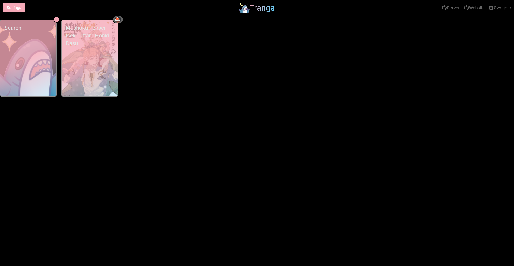
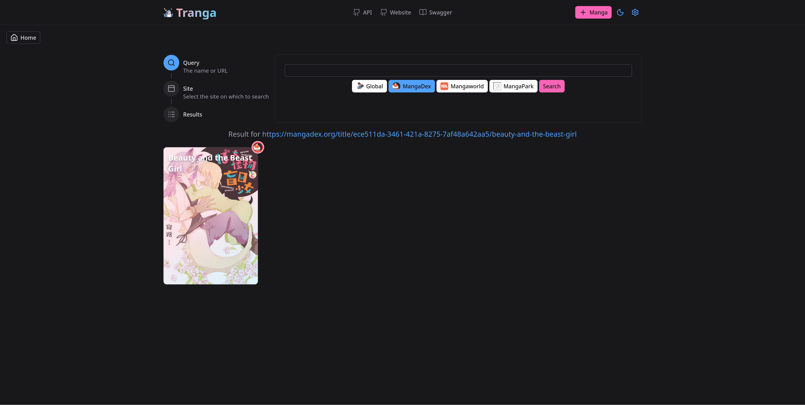
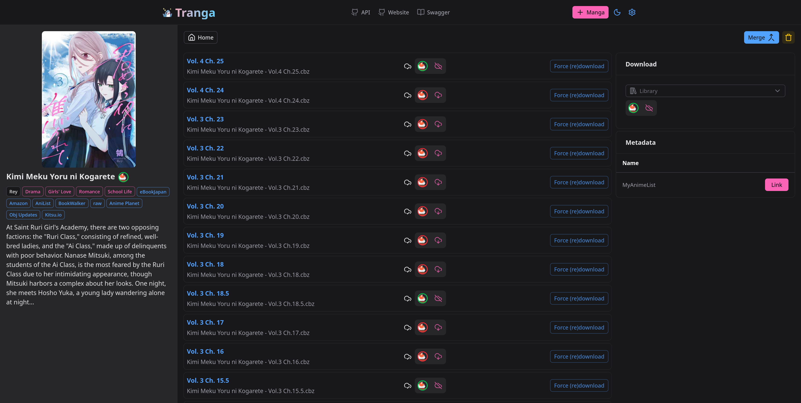

 

<h3 align="center">Tranga-Website</h3>

  

    Automatic Manga and Metadata downloader 
  

  

    This is the Website for <a href="https://github.com/C9Glax/tranga">Tranga</a> (API)  
  

  

  <table>
    
  </table>

<!-- ABOUT THE PROJECT -->
## Screenshots

|  |  |  |
|----------------------------------------|------------------------------------------|------------------------------------------------|
| Overview                               | Search Dialog                            | Manga Detail                                   |

## About The Project

Tranga-Website is the Web-frontend to [Tranga](https://github.com/C9Glax/tranga) (the API).

### What this does do (and nothing else)

This project makes HTTP-requests to the [Tranga-API](https://github.com/C9Glax/tranga) to display and modify the present configuration.

## Built With

- nginx
- [nuxt](https://github.com/nuxt/nuxt)
- [nuxt ui](https://github.com/nuxt/ui)
- [vue](https://github.com/vuejs/)
- [vite](https://github.com/vitejs/vite)
- 💙 Blåhaj 🦈

(<a href="#readme-top">back to top</a>)

<!-- GETTING STARTED -->
## Getting Started

Go to [Tranga](https://github.com/C9Glax/tranga?tab=readme-ov-file#getting-started) and read the README there.

<!-- CONTRIBUTING -->
## Contributing

Go to [Tranga](https://github.com/C9Glax/tranga?tab=readme-ov-file#contributing) and read the README there.

<!-- LICENSE -->
## License

See `LICENSE.txt` for more information.

(<a href="#readme-top">back to top</a>)

<!-- ACKNOWLEDGMENTS -->
## Acknowledgments

* [Choose an Open Source License](https://choosealicense.com)
* [Font Awesome](https://fontawesome.com)
* [Best-README-Template](https://github.com/othneildrew/Best-README-Template/tree/master)

(<a href="#readme-top">back to top</a>)

